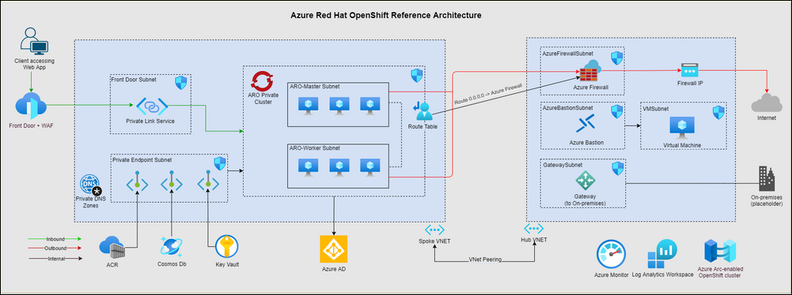
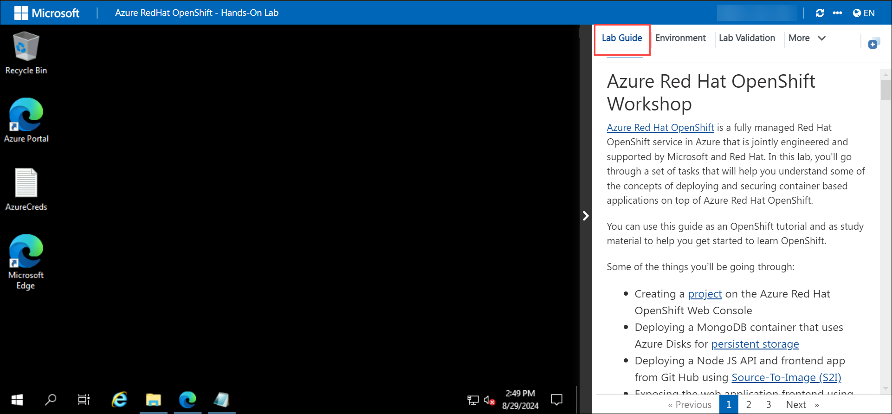
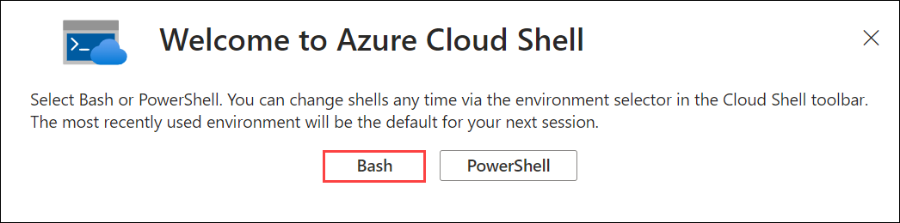
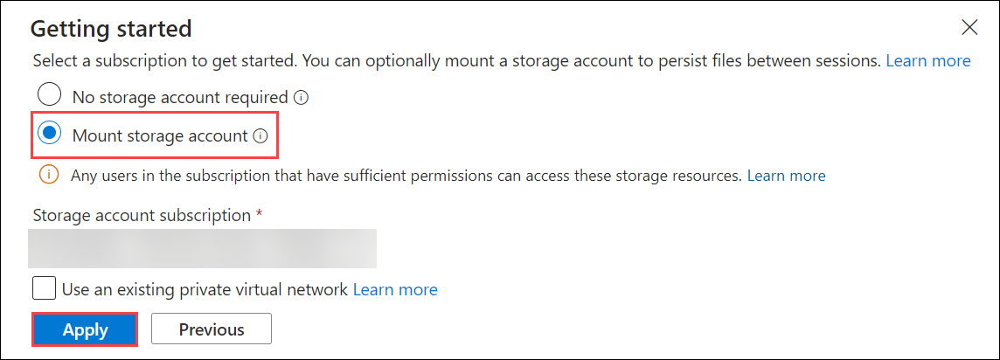
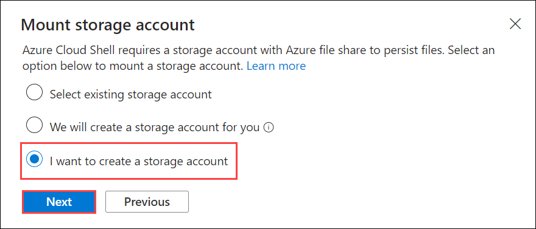
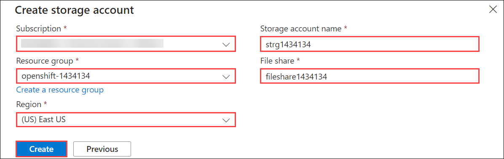
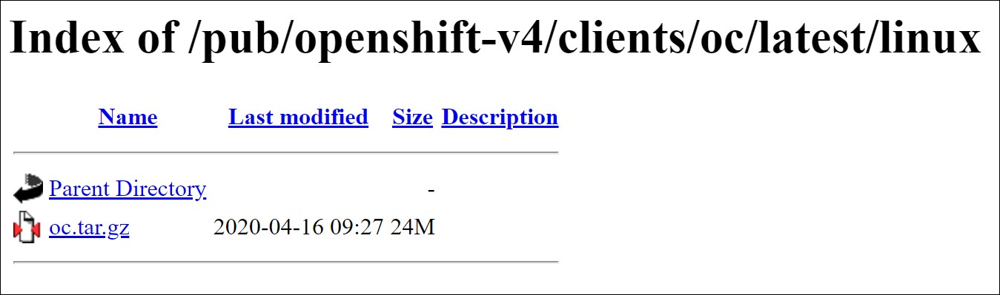

# Azure RedHat OpenShift Workshop

### Overall Estimated Duration: 4 hours

## Overview

Azure Red Hat OpenShift is a fully managed Red Hat OpenShift service in Azure that is jointly engineered and supported by Microsoft and Red Hat. In this lab, you'll go through a set of tasks that will help you understand some of the concepts of deploying and securing container based applications on top of Azure Red Hat OpenShift.

## Objective

This lab is designed to equip participants with hands-on experience in insights on Azure RedHat OpenShift Cluster. By completing this lab, participants will learn to:

- Creating a project on the Azure Red Hat OpenShift Web Console.
- Deploying a MongoDB container that uses Azure Disks for persistent storage.
- Deploying a Node JS API and frontend app from Git Hub using Source-To-Image (S2I).
- Exposing the web application frontend using Routes.
- Creating a network policy to control communication between the different tiers in the application.

You'll be doing the majority of the labs using the OpenShift CLI, but you can also accomplish them using the Azure Red Hat OpenShift web console.

## Prerequisites

Participants should have:

- **Basic Knowledge of Cloud Computing:** Understanding fundamental cloud concepts, especially related to Azure, will be beneficial.
- **Familiarity with OpenShift:** A basic grasp of what OpenShift is and how it operates can help, though detailed experience is not always required.
- **Experience with Linux Command Line:** Since OpenShift runs on Linux-based containers, knowing how to use the command line in a Linux environment is useful.
- **Understanding of Containers and Kubernetes:** Familiarity with containerization concepts and Kubernetes basics is important as OpenShift is built on Kubernetes.
- **Basic Programming or Scripting Skills:** Basic scripting skills (e.g., Bash, PowerShell) can be helpful for automating tasks and interacting with the environment.
- **Azure Portal Navigation:** Comfort with navigating the Azure Portal, as well as understanding basic Azure services, will help participants manage and deploy resources effectively.

## Architecture

This lab manifests integrating ARO with several Azure services such as Azure Front Door + WAF for securely handling ingress traffic, Firewall for inspecting egress traffic to avoid data exfiltration, and Azure Active Directory for Role Based Access Control and so on.  Also, provides several recommended best practices for ARO deployment, from Networking best practices that supports multi-region growth, on-boarding the cluster on to Arc and enabling Container Insights to monitor the cluster and workload.

## Architecture Diagram



## Explanation of Components

The architecture for this lab involves several key components:

- **Azure Red Hat OpenShift:** A fully managed OpenShift service on Azure, providing a platform to deploy, manage, and scale containerized applications.
- **Azure Virtual Network (VNet):** Creates isolated and secure network environments for communication between Azure resources.
- **Azure Storage Account:** Provides scalable storage solutions for various types of data, such as blobs, files, and queues, which applications running in OpenShift can use.
- **Azure Key Vault:** Protects sensitive information like secrets, keys, and certificates used by applications and services.
- **MongoDB Atlas:** A cloud-based database service providing a managed MongoDB environment, which can be integrated with OpenShift applications for data storage and management.
- **Azure Load Balancer:** Distributes incoming network traffic across multiple servers to ensure high availability and reliability of applications running in the OpenShift cluster.
- **Master Nodes:** The control plane components in the ARO cluster responsible for managing and orchestrating the worker nodes and overall cluster state.
- **Worker Nodes:** The compute resources in the ARO cluster that run application containers and provide the processing power required for the workloads.

## Getting Started with Your Lab Environment
 
Welcome to your Azure RedHat OpenShift Workshop! We've prepared a seamless environment for you to explore and learn about Azure services. Let's begin by making the most of this experience.
 
## Accessing Your Lab Environment
 
Once you're ready to dive in, your virtual machine and lab guide will be right at your fingertips within your web browser.

  

### Virtual Machine & Lab Guide
 
 Your virtual machine is your main tool throughout the workshop. The lab guide is your roadmap to success.
 
## Exploring Your Lab Resources
 
To get a better understanding of your lab resources and credentials, navigate to the **Environment** tab.
 
  
 
## Utilizing the Split Window Feature
 
For convenience, you can open the lab guide in a separate window by clicking on the **Split Window** button in the top right corner.
 
  
 
## Managing Your Virtual Machine
 
Feel free to **start, stop, or restart (2)** your virtual machine as needed from the **Resources (1)** tab. Your experience is in your hands!

  

## Let's Get Started with the Azure Portal
 
1. On your virtual machine, click on the **Azure Portal (1)** icon, as shown below.
 
    

1. On the **Sign in to Microsoft Azure** tab, you will see the login screen. In that, enter the following and click on **Next**. 

   * **Email/Username**: <inject key="AzureAdUserEmail"></inject>
   
      
     
1. Next, enter the **password** and click on **Sign in**.
   
   * **Password**: <inject key="AzureAdUserPassword"></inject>
   
      

1. If you see the pop-up **Action Required**, click on **Ask Later**.

   
     
1. Select **No,** if you see the pop-up, **Stay Signed in.**

1. If you see the pop-up, **You have free Azure Advisor recommendations!** Close the window to continue the lab.

1. If a **Welcome to Microsoft Azure** pop-up window appears, select **Maybe Later** to skip the tour.

### Setup Azure Cloud Shell

You can use the Azure Cloud Shell accessible at <https://shell.azure.com> once you login with an Azure subscription.

Head over to <https://shell.azure.com> and sign in with your Azure Subscription details.

1. Select **Bash** as your shell.

   

1. Select **Mount storage account**, your default **Subscription** and click **Apply**.

   

1. Select **I want to create a storage account** and click **Next**.

   

1. Specify then following values and click **Create** to create a new storage account.

   - Subscription: **Select your default subscription**
   - Resource group: **openshift**
   - Region: **<inject key="Region" enableCopy="false"/>**
   - Storage account name: **strg<inject key="Deployment ID" enableCopy="false"/>**
   - File share: **none**

   

1. You should now have access to the Azure Cloud Shell.

   

<validation step="e4da372d-001a-4680-ba58-23f917916623" />

### OpenShift CLI (oc)

You'll need to download the **latest OpenShift CLI (oc)** client tools for OpenShift 4. You can follow the steps below on the Azure Cloud Shell.

> **Note** You'll need to change the link below to the latest link you get from the page.
> 

Please run following commands on Azure Cloud Shell to download and setup the OpenShift client.

```sh
cd ~
curl https://mirror.openshift.com/pub/openshift-v4/clients/ocp/latest/openshift-client-linux.tar.gz > openshift-client-linux.tar.gz

mkdir openshift

tar -zxvf openshift-client-linux.tar.gz -C openshift

echo 'export PATH=$PATH:~/openshift' >> ~/.bashrc && source ~/.bashrc

```

The OpenShift CLI (oc) is now installed.

In case you want to work from your own operating system, here are the links to the different versions of CLI:

- https://mirror.openshift.com/pub/openshift-v4/clients/ocp/latest/openshift-client-windows.zip
- https://mirror.openshift.com/pub/openshift-v4/clients/ocp/latest/openshift-client-linux.tar.gz
- https://mirror.openshift.com/pub/openshift-v4/clients/ocp/latest/openshift-client-mac.tar.gz

### GitHub Account

You'll need a personal GitHub account. You can sign up for free [here](https://github.com/join).

## Basic concepts

### Source-To-Image (S2I)

Source-to-Image (S2I) is a toolkit and workflow for building reproducible container images from source code. S2I produces ready-to-run images by injecting source code into a container image and letting the container prepare that source code for execution. By creating self-assembling builder images, you can version and control your build environments exactly like you use container images to version your runtime environments.

#### How it works

For a dynamic language like Ruby, the build-time and run-time environments are typically the same. Starting with a builder image that describes this environment - with Ruby, Bundler, Rake, Apache, GCC, and other packages needed to set up and run a Ruby application installed - source-to-image performs the following steps:

1. Start a container from the builder image with the application source injected into a known directory

1. The container process transforms that source code into the appropriate runnable setup - in this case, by installing dependencies with Bundler and moving the source code into a directory where Apache has been preconfigured to look for the Ruby config.ru file.

1. Commit the new container and set the image entrypoint to be a script (provided by the builder image) that will start Apache to host the Ruby application.

For compiled languages like C, C++, Go, or Java, the dependencies necessary for compilation might dramatically outweigh the size of the actual runtime artifacts. To keep runtime images slim, S2I enables a multiple-step build processes, where a binary artifact such as an executable or Java WAR file is created in the first builder image, extracted, and injected into a second runtime image that simply places the executable in the correct location for execution.

For example, to create a reproducible build pipeline for Tomcat (the popular Java webserver) and Maven:

1. Create a builder image containing OpenJDK and Tomcat that expects to have a WAR file injected

1. Create a second image that layers on top of the first image Maven and any other standard dependencies, and expects to have a Maven project injected

1. Invoke source-to-image using the Java application source and the Maven image to create the desired application WAR

1. Invoke source-to-image a second time using the WAR file from the previous step and the initial Tomcat image to create the runtime image

By placing our build logic inside of images, and by combining the images into multiple steps, we can keep our runtime environment close to our build environment (same JDK, same Tomcat JARs) without requiring build tools to be deployed to production.

#### Goals and benefits

##### Reproducibility

Allow build environments to be tightly versioned by encapsulating them within a container image and defining a simple interface (injected source code) for callers. Reproducible builds are a key requirement to enabling security updates and continuous integration in containerized infrastructure, and builder images help ensure repeatability as well as the ability to swap runtimes.

##### Flexibility

Any existing build system that can run on Linux can be run inside of a container, and each individual builder can also be part of a larger pipeline. In addition, the scripts that process the application source code can be injected into the builder image, allowing authors to adapt existing images to enable source handling.

##### Speed

Instead of building multiple layers in a single Dockerfile, S2I encourages authors to represent an application in a single image layer. This saves time during creation and deployment, and allows for better control over the output of the final image.

##### Security

Dockerfiles are run without many of the normal operational controls of containers, usually running as root and having access to the container network. S2I can be used to control what permissions and privileges are available to the builder image since the build is launched in a single container. In concert with platforms like OpenShift, source-to-image can enable admins to tightly control what privileges developers have at build time.

### Routes

An OpenShift `Route` exposes a service at a host name, like www.example.com, so that external clients can reach it by name. When a `Route` object is created on OpenShift, it gets picked up by the built-in HAProxy load balancer in order to expose the requested service and make it externally available with the given configuration. You might be familiar with the Kubernetes `Ingress` object and might already be asking "what's the difference?". Red Hat created the concept of `Route` in order to fill this need and then contributed the design principles behind this to the community; which heavily influenced the `Ingress` design.  Though a `Route` does have some additional features as can be seen in the chart below.


> **NOTE:** DNS resolution for a host name is handled separately from routing; your administrator may have configured a cloud domain that will always correctly resolve to the router, or if using an unrelated host name you may need to modify its DNS records independently to resolve to the router.

Also of note is that an individual route can override some defaults by providing specific configuraitons in its annotations.  See here for more details: [https://docs.openshift.com/aro/4/networking/routes/route-configuration.html](https://docs.openshift.com/aro/4/networking/routes/route-configuration.html)

### ImageStreams

An ImageStream stores a mapping of tags to images, metadata overrides that are applied when images are tagged in a stream, and an optional reference to a Docker image repository on a registry.

#### What are the benefits

Using an ImageStream makes it easy to change a tag for a container image.  Otherwise to change a tag you need to download the whole image, change it locally, then push it all back. Also promoting applications by having to do that to change the tag and then update the deployment object entails many steps.  With ImageStreams you upload a container image once and then you manage it’s virtual tags internally in OpenShift.  In one project you may use the `dev` tag and only change reference to it internally, in prod you may use a `prod` tag and also manage it internally. You don't really have to deal with the registry!

You can also use ImageStreams in conjunction with DeploymentConfigs to set a trigger that will start a deployment as soon as a new image appears or a tag changes its reference.

See here for more details: [https://blog.openshift.com/image-streams-faq/](https://blog.openshift.com/image-streams-faq/) <br>
OpenShift Docs: [https://docs.openshift.com/aro/4/openshift_images/managing_images/managing-images-overview.html](https://docs.openshift.com/aro/4/openshift_images/managing_images/managing-images-overview.html)<br>
ImageStream and Builds: [https://cloudowski.com/articles/why-managing-container-images-on-openshift-is-better-than-on-kubernetes/](https://cloudowski.com/articles/why-managing-container-images-on-openshift-is-better-than-on-kubernetes/)

### Builds

A build is the process of transforming input parameters into a resulting object. Most often, the process is used to transform input parameters or source code into a runnable image. A BuildConfig object is the definition of the entire build process.

OpenShift Container Platform leverages Kubernetes by creating Docker-formatted containers from build images and pushing them to a container image registry.

Build objects share common characteristics: inputs for a build, the need to complete a build process, logging the build process, publishing resources from successful builds, and publishing the final status of the build. Builds take advantage of resource restrictions, specifying limitations on resources such as CPU usage, memory usage, and build or pod execution time.

See here for more details: [https://docs.openshift.com/aro/4/openshift_images/image-streams-manage.html](https://docs.openshift.com/aro/4/openshift_images/image-streams-manage.html)

## Support Contact
 
The CloudLabs support team is available 24/7, 365 days a year, via email and live chat to ensure seamless assistance at any time. We offer dedicated support channels tailored specifically for both learners and instructors, ensuring that all your needs are promptly and efficiently addressed.

Learner Support Contacts:
- Email Support: labs-support@spektrasystems.com
- Live Chat Support: https://cloudlabs.ai/labs-support

Now, click on **Next** from the lower right corner to move on to the next page.


### Happy Learning!
