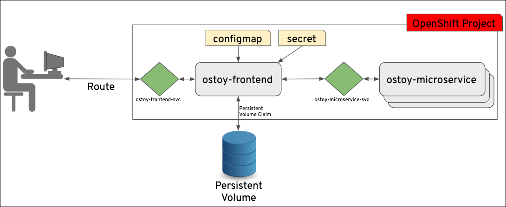
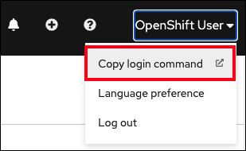
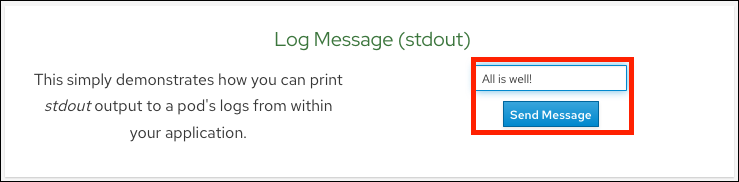
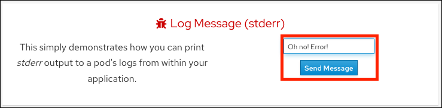
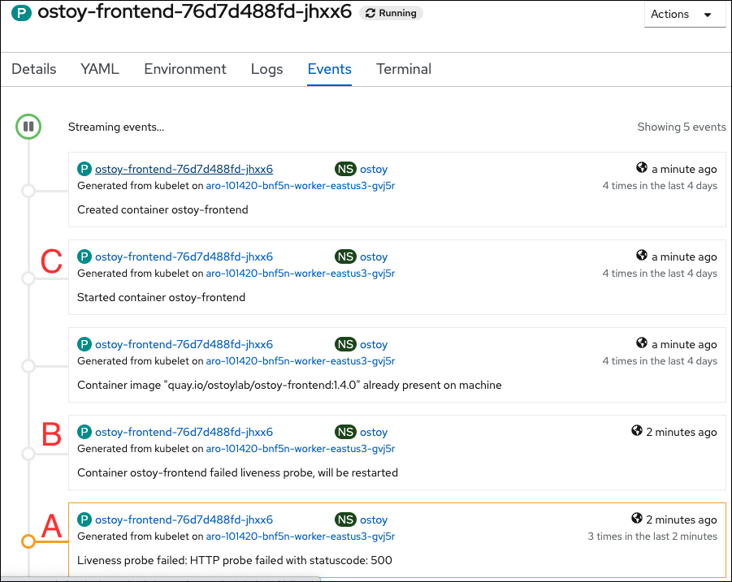
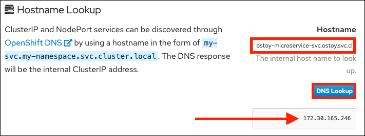
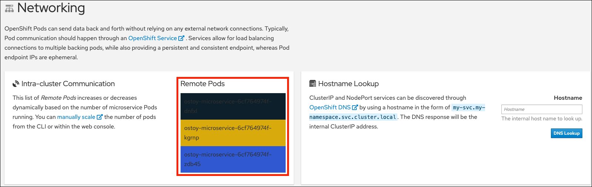
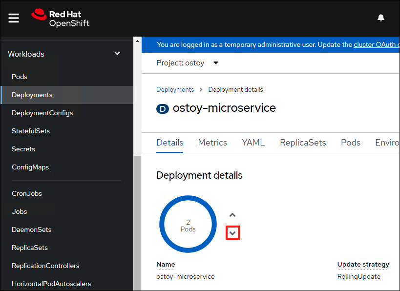
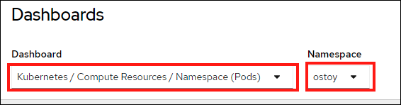
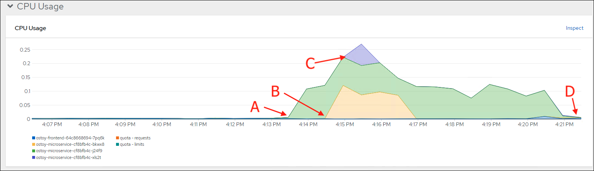

# Lab 2 - ARO Internals

## 3.1 Application Overview

### Resources

- The source code for this app is available here: <https://github.com/openshift-cs/ostoy>
- OSToy front-end container image: <https://quay.io/repository/ostoylab/ostoy-frontend?tab=tags>
- OSToy microservice container image: <https://quay.io/repository/ostoylab/ostoy-microservice?tab=tags>
- Deployment Definition YAMLs:
  - [ostoy-fe-deployment.yaml](https://raw.githubusercontent.com/microsoft/aroworkshop/master/yaml/ostoy-fe-deployment.yaml)
  - [ostoy-microservice-deployment.yaml](https://raw.githubusercontent.com/microsoft/aroworkshop/master/yaml/ostoy-microservice-deployment.yaml)

> **Note** In order to simplify the deployment of the app (which you will do next) we have included all the objects needed in the above YAMLs as "all-in-one" YAMLs.  In reality though, an enterprise would most likely want to have a different yaml file for each Kubernetes object.

### About OSToy

OSToy is a simple Node.js application that we will deploy to Azure Red Hat OpenShift. It is used to help us explore the functionality of Kubernetes. This application has a user interface which you can:

- write messages to the log (stdout / stderr)
- intentionally crash the application to view self-healing
- toggle a liveness probe and monitor OpenShift behavior
- read config maps, secrets, and env variables
- if connected to shared storage, read and write files
- check network connectivity, intra-cluster DNS, and intra-communication with an included microservice
- increase the load to view automatic scaling of the pods to handle the load (via the Horizontal Pod Autoscaler)

### OSToy Application Diagram



### Familiarization with the Application UI

1. Shows the pod name that served your browser the page.
2. **Home:** The main page of the application where you can perform some of the functions listed which we will explore.
3. **Persistent Storage:**  Allows us to write data to the persistent volume bound to this application.
4. **Config Maps:**  Shows the contents of configmaps available to the application and the key:value pairs.
5. **Secrets:** Shows the contents of secrets available to the application and the key:value pairs.
6. **ENV Variables:** Shows the environment variables available to the application.
7. **Auto Scaling:** Explore the Horizontal Pod Autoscaler to see how increased loads are handled.
8. **Networking:** Tools to illustrate networking within the application.
9. **About:** Shows some more information about the application.


### Learn more about the application

To learn more, click on the "About" menu item on the left once we deploy the app.


## 3.2 Application Deployment

### Retrieve login command

If not logged in via the CLI, click on the dropdown arrow next to your name in the top-right and select *Copy Login Command*.



A new tab will open click "Display Token"

Copy the command under where it says "Log in with this token". Then go to your terminal and paste that command and press enter. You will see a similar confirmation message if you successfully logged in.

```
$ oc login --token=sha256~qWBXdQ_X_4wWZor0XZO00ZZXXXXXXXXXXXX --server=https://api.abcs1234.westus.aroapp.io:6443
Logged into "https://api.abcd1234.westus.aroapp.io:6443" as "kube:admin" using the token provided.

You have access to 67 projects, the list has been suppressed. You can list all projects with 'oc projects'

Using project "default".
```

### Create new project

Create a new project called "OSToy" in your cluster.

Use the following command

`oc new-project ostoy`

You should receive the following response

```
$ oc new-project ostoy
Now using project "ostoy" on server "https://api.abcd1234.westus2.aroapp.io:6443".
[...]
```

Equivalently you can also create this new project using the web console by selecting *Home > Projects* on the left menu, then clicking on the "Create Project" button on the right.


### View the YAML deployment objects

View the Kubernetes deployment object YAMLs.  If you wish you can download them from the following locations to your Azure Cloud Shell, to your local machine, or just use the direct link in the next steps.

Feel free to open them up and take a look at what we will be deploying. For simplicity of this lab we have placed all the Kubernetes objects we are deploying in one "all-in-one" YAML file.  Though in reality there are benefits (ease of maintenance and less risk) to separating these out into individual files.

[ostoy-fe-deployment.yaml](https://github.com/microsoft/aroworkshop/blob/master/yaml/ostoy-fe-deployment.yaml)

[ostoy-microservice-deployment.yaml](https://github.com/microsoft/aroworkshop/blob/master/yaml/ostoy-microservice-deployment.yaml)

### Deploy backend microservice

The microservice serves internal web requests and returns a JSON object containing the current hostname and a randomly generated color string.

In your terminal deploy the microservice using the following command:

`oc apply -f https://raw.githubusercontent.com/microsoft/aroworkshop/master/yaml/ostoy-microservice-deployment.yaml`

You should see the following response:
```
$ oc apply -f https://raw.githubusercontent.com/microsoft/aroworkshop/master/yaml/ostoy-microservice-deployment.yaml
deployment.apps/ostoy-microservice created
service/ostoy-microservice-svc created
```

### Deploy the front-end service

This deployment contains the node.js frontend for our application along with a few other Kubernetes objects.

 If you open the *ostoy-fe-deployment.yaml* you will see we are defining:

- Persistent Volume Claim
- Deployment Object
- Service
- Route
- Configmaps
- Secrets

Deploy the frontend along with creating all objects mentioned above by entering:

`oc apply -f https://raw.githubusercontent.com/microsoft/aroworkshop/master/yaml/ostoy-fe-deployment.yaml`

You should see all objects created successfully

```
$ oc apply -f https://raw.githubusercontent.com/microsoft/aroworkshop/master/yaml/ostoy-fe-deployment.yaml
persistentvolumeclaim/ostoy-pvc created
deployment.apps/ostoy-frontend created
service/ostoy-frontend-svc created
route.route.openshift.io/ostoy-route created
configmap/ostoy-configmap-env created
secret/ostoy-secret-env created
configmap/ostoy-configmap-files created
secret/ostoy-secret created
```

### Get route

Get the route so that we can access the application via:

 `oc get route`
 
You should see the following response:

```
NAME           HOST/PORT                                                      PATH      SERVICES              PORT      TERMINATION   WILDCARD
ostoy-route   ostoy-route-ostoy.apps.abcd1234.westus2.aroapp.io             ostoy-frontend-svc   <all>                   None
```

Copy `ostoy-route-ostoy.apps.abcd1234.westus2.aroapp.io` above and paste it into your browser and press enter.  You should see the homepage of our application.


## 3.3 Logging and Metrics

Assuming you can access the application via the Route provided and are still logged into the CLI (please go back to part 2 if you need to do any of those) we'll start to use this application.  As stated earlier, this application will allow you to "push the buttons" of OpenShift and see how it works.  We will do this to test the logs.

Click on the *Home* menu item and then click in the message box for "Log Message (stdout)" and write any message you want to output to the *stdout* stream.  You can try "**All is well!**".  Then click "Send Message".



Click in the message box for "Log Message (stderr)" and write any message you want to output to the *stderr* stream. You can try "**Oh no! Error!**".  Then click "Send Message".



### View logs directly from the pod

Go to the CLI and enter the following command to retrieve the name of your frontend pod which we will use to view the pod logs:

```
$ oc get pods -o name
pod/ostoy-frontend-679cb85695-5cn7x
pod/ostoy-microservice-86b4c6f559-p594d
```

So the pod name in this case is **ostoy-frontend-679cb85695-5cn7x**.  Then run `oc logs ostoy-frontend-679cb85695-5cn7x` and you should see your messages:

```
$ oc logs ostoy-frontend-679cb85695-5cn7x
[...]
ostoy-frontend-679cb85695-5cn7x: server starting on port 8080
Redirecting to /home
stdout: All is well!
stderr: Oh no! Error!
```

You should see both the *stdout* and *stderr* messages.

Try to see them from within the OpenShift Web Console as well. Make sure you are in the "ostoy" project. In the left menu click *Workloads > Pods > \<frontend-pod-name>*.  Then click the "Logs" sub-tab.


## 3.4 Exploring Health Checks

In this section we will intentionally crash our pods and also make a pod non-responsive to the liveness probes and see how Kubernetes behaves.  We will first intentionally crash our pod and see that Kubernetes will self-heal by immediately spinning it back up. Then we will trigger the health check by stopping the response on the `/health` endpoint in our app. After three consecutive failures, Kubernetes should kill the pod and then recreate it.

It would be best to prepare by splitting your screen between the OpenShift Web Console and the OSToy application so that you can see the results of our actions immediately.


But if your screen is too small or that just won't work, then open the OSToy application in another tab so you can quickly switch to the OpenShift Web Console once you click the button. To get to this deployment in the OpenShift Web Console go to the left menu and click:

*Workloads > Deployments > "ostoy-frontend"*

Go to the browser tab that has your OSToy app, click on *Home* in the left menu, and enter a message in the "Crash Pod" tile (e.g., "This is goodbye!") and press the "Crash Pod" button.  This will cause the pod to crash and Kubernetes should restart the pod. After you press the button you will see:


Quickly switch to the tab with the deployment showing in the web console. You will see that the pod turns yellowish, meaning it is down but should quickly come back up and show blue.  It does happen quickly so you might miss it.


You can also check in the pod events and further verify that the container has crashed and been restarted.

Click on *Pods > [Pod Name] > Events*


Keep the page from the pod events still open from the previous step.  Then in the OSToy app click on the "Toggle Health" button, in the "Toggle health status" tile.  You will see the "Current Health" switch to "I'm not feeling all that well".


This will cause the app to stop responding with a "200 HTTP code". After 3 such consecutive failures ("A"), Kubernetes will kill the pod ("B") and restart it ("C"). Quickly switch back to the pod events tab and you will see that the liveness probe failed and the pod as being restarted.



## 3.5 Persistent Storage

In this section we will execute a simple example of using persistent storage by creating a file that will be stored on a persistent volume in our cluster and then confirm that it will "persist" across pod failures and recreation.

Inside the OpenShift web console click on *Storage > Persistent Volume Claims* in the left menu. You will then see a list of all persistent volume claims that our application has made.  In this case there is just one called "ostoy-pvc".  If you click on it you will also see other pertinent information such as whether it is bound or not, size, access mode and creation time.  

In this case the mode is RWO (Read-Write-Once) which means that the volume can only be mounted to one node, but the pod(s) can both read and write to that volume.  The [default in ARO](https://docs.microsoft.com/en-us/azure/openshift/openshift-faq#can-we-choose-any-persistent-storage-solution--like-ocs) is for Persistent Volumes to be backed by Azure Disk, but it is possible to [use Azure Files](https://docs.openshift.com/container-platform/latest/storage/persistent_storage/persistent-storage-azure-file.html) so that you can use the RWX (Read-Write-Many) access mode.  See here for more info on [access modes](https://docs.openshift.com/container-platform/latest/storage/understanding-persistent-storage.html#pv-access-modes_understanding-persistent-storage).

In the OSToy app click on *Persistent Storage* in the left menu.  In the "Filename" area enter a filename for the file you will create (e.g., "test-pv.txt"). Use the ".txt" extension so you can easily open it in the browser.

Underneath that, in the "File contents" box, enter text to be stored in the file. (e.g., "Azure Red Hat OpenShift is the greatest thing since sliced bread!"). Then click "Create file".


You will then see the file you created appear above under "Existing files".  Click on the file and you will see the filename and the contents you entered.


We now want to kill the pod and ensure that the new pod that spins up will be able to see the file we created. Exactly like we did in the previous section. Click on *Home* in the left menu.

Click on the "Crash pod" button.  (You can enter a message if you'd like).

Click on *Persistent Storage* in the left menu.

You will see the file you created is still there and you can open it to view its contents to confirm.


Now let's confirm that it's actually there by using the CLI and checking if it is available to the container.  If you remember we [mounted the directory](https://github.com/microsoft/aroworkshop/blob/master/yaml/ostoy-fe-deployment.yaml#L50) `/var/demo_files` to our PVC.  So get the name of your frontend pod:

`oc get pods`

then get an SSH session into the container

`oc rsh <pod name>`

then `cd /var/demo_files`

if you enter `ls` you can see all the files you created.  Next, let's open the file we created and see the contents

`cat test-pv.txt`

You should see the text you entered in the UI.

```
$ oc get pods
NAME                                  READY     STATUS    RESTARTS   AGE
ostoy-frontend-5fc8d486dc-wsw24       1/1       Running   0          18m
ostoy-microservice-6cf764974f-hx4qm   1/1       Running   0          18m

$ oc rsh ostoy-frontend-5fc8d486dc-wsw24

/ $ cd /var/demo_files/

/var/demo_files $ ls
lost+found   test-pv.txt

/var/demo_files $ cat test-pv.txt
Azure Red Hat OpenShift is the greatest thing since sliced bread!
```

Then exit the SSH session by typing `exit`. You will then be in your CLI.

## 3.6 Configuration

In this section we'll take a look at how OSToy can be configured using [ConfigMaps](https://docs.openshift.com/container-platform/latest/nodes/pods/nodes-pods-configmaps.html), [Secrets](https://docs.openshift.com/container-platform/latest/cicd/builds/creating-build-inputs.html#builds-input-secrets-configmaps_creating-build-inputs), and [Environment Variables](https://docs.openshift.com/container-platform/3.11/dev_guide/environment_variables.html).  This section won't go into details explaining each (the links above are for that), but will show you how they are exposed to the application.  

### Configuration using ConfigMaps

ConfigMaps allow you to decouple configuration artifacts from container image content to keep containerized applications portable.

Click on *Config Maps* in the left menu.

This will display the contents of the configmap available to the OSToy application.  We defined this in the `ostoy-fe-deployment.yaml` here:

```
kind: ConfigMap
apiVersion: v1
metadata:
  name: ostoy-configmap-files
data:
  config.json:  '{ "default": "123" }'
```

### Configuration using Secrets

Kubernetes Secret objects allow you to store and manage sensitive information, such as passwords, OAuth tokens, and ssh keys. Putting this information in a secret is safer and more flexible than putting it, verbatim, into a pod definition or a container image.

Click on *Secrets* in the left menu.

This will display the contents of the secrets available to the OSToy application.  We defined this in the `ostoy-fe-deployment.yaml` here:

```
apiVersion: v1
kind: Secret
metadata:
  name: ostoy-secret
data:
  secret.txt: VVNFUk5BTUU9bXlfdXNlcgpQQVNTV09SRD1AT3RCbCVYQXAhIzYzMlk1RndDQE1UUWsKU01UUD1sb2NhbGhvc3QKU01UUF9QT1JUPTI1
type: Opaque
```

### Configuration using Environment Variables

Using environment variables is an easy way to change application behavior without requiring code changes. It allows different deployments of the same application to potentially behave differently based on the environment variables, and OpenShift makes it simple to set, view, and update environment variables for Pods/Deployments.

Click on *ENV Variables* in the left menu.

This will display the environment variables available to the OSToy application.  We added three as defined in the deployment spec of `ostoy-fe-deployment.yaml` here:

```
  env:
  - name: ENV_TOY_CONFIGMAP
    valueFrom:
      configMapKeyRef:
        name: ostoy-configmap-env
        key: ENV_TOY_CONFIGMAP
  - name: ENV_TOY_SECRET
    valueFrom:
      secretKeyRef:
        name: ostoy-secret-env
        key: ENV_TOY_SECRET
  - name: MICROSERVICE_NAME
    value: OSTOY_MICROSERVICE_SVC
```

The last one, `MICROSERVICE_NAME` is used for the intra-cluster communications between pods for this application.  The application looks for this environment variable to know how to access the microservice in order to get the colors.

## 3.7 Networking and Scaling

In this section we'll see how OSToy uses intra-cluster networking to separate functions by using microservices and visualize the scaling of pods.

Let's review how this application is set up...


As can be seen in the image above we have defined at least 2 separate pods, each with its own service.  One is the frontend web application (with a service and a publicly accessible route) and the other is the backend microservice with a service object created so that the frontend pod can communicate with the microservice (across the pods if more than one).  Therefore this microservice is not accessible from outside this cluster (or from other namespaces/projects, if configured, due to OpenShifts' network policy, [ovs-networkpolicy](https://docs.openshift.com/container-platform/latest/networking/network_policy/about-network-policy.html#nw-networkpolicy-about_about-network-policy)).  The sole purpose of this microservice is to serve internal web requests and return a JSON object containing the current hostname and a randomly generated color string.  This color string is used to display a box with that color displayed in the tile titled "Intra-cluster Communication".

### Networking

Click on *Networking* in the left menu. Review the networking configuration.

The right tile titled "Hostname Lookup" illustrates how the service name created for a pod can be used to translate into an internal ClusterIP address. Enter the name of the microservice following the format of `my-svc.my-namespace.svc.cluster.local` which we created in our `ostoy-microservice.yaml` as seen here:

```
apiVersion: v1
kind: Service
metadata:
  name: ostoy-microservice-svc
  labels:
    app: ostoy-microservice
spec:
  type: ClusterIP
  ports:
    - port: 8080
      targetPort: 8080
      protocol: TCP
  selector:
    app: ostoy-microservice
```

In this case we will enter: `ostoy-microservice-svc.ostoy.svc.cluster.local`

We will see an IP address returned.  In our example it is `172.30.165.246`.  This is the intra-cluster IP address; only accessible from within the cluster.



### Scaling

OpenShift allows one to scale up/down the number of pods for each part of an application as needed.  This can be accomplished via changing our *replicaset/deployment* definition (declarative), by the command line (imperative), or via the web console (imperative). In our *deployment* definition (part of our `ostoy-fe-deployment.yaml`) we stated that we only want one pod for our microservice to start with. This means that the Kubernetes Replication Controller will always strive to keep one pod alive. We can also define pod autoscaling using the [Horizontal Pod Autoscaler](https://docs.openshift.com/container-platform/latest/nodes/pods/nodes-pods-autoscaling.html) (HPA) based on load to expand past what we defined. We will do this in a later section of this lab.

If we look at the tile on the left we should see one box randomly changing colors.  This box displays the randomly generated color sent to the frontend by our microservice along with the pod name that sent it. Since we see only one box that means there is only one microservice pod.  We will now scale up our microservice pods and will see the number of boxes change.

To confirm that we only have one pod running for our microservice, run the following command, or use the web console.

```
$ oc get pods
NAME                                   READY     STATUS    RESTARTS   AGE
ostoy-frontend-679cb85695-5cn7x       1/1       Running   0          1h
ostoy-microservice-86b4c6f559-p594d   1/1       Running   0          1h
```

Let's change our microservice definition yaml to reflect that we want 3 pods instead of the one we see. Download the [ostoy-microservice-deployment.yaml](yaml/ostoy-microservice-deployment.yaml) and save it on your local machine.

Open the file using your favorite editor. Ex: `vi ostoy-microservice-deployment.yaml`.

Find the line that states `replicas: 1` and change that to `replicas: 3`. Then save and quit.

It will look like this

```
spec:
    selector:
      matchLabels:
        app: ostoy-microservice
    replicas: 3
 ```

Assuming you are still logged in via the CLI, execute the following command:

`oc apply -f ostoy-microservice-deployment.yaml`

Confirm that there are now 3 pods via the CLI (`oc get pods`) or the web console (*Workloads > Deployments > ostoy-microservice*).

See this visually by visiting the OSToy app and seeing how many boxes you now see.  It should be three.



Now we will scale the pods down using the command line.  Execute the following command from the CLI:

`oc scale deployment ostoy-microservice --replicas=2`

Confirm that there are indeed 2 pods, via the CLI (`oc get pods`) or the web console.

See this visually by visiting the OSToy App and seeing how many boxes you now see.  It should be two.

Lastly, let's use the web console to scale back down to one pod.  Make sure you are in the project you created for this app (i.e., "ostoy"), in the left menu click *Workloads > Deployments > ostoy-microservice*.  On the left you will see a blue circle with the number 2 in the middle. Click on the down arrow to the right of that to scale the number of pods down to 1.



See this visually by visiting the OSToy app and seeing how many boxes you now see.  It should be one.  You can also confirm this via the CLI or the web console.

## 3.8 Pod Autoscaling

In this section we will explore how the [Horizontal Pod Autoscaler](https://docs.openshift.com/container-platform/latest/nodes/pods/nodes-pods-autoscaling.html) (HPA) can be used and works within Kubernetes/OpenShift.

As defined in the documentation:
> [...] you can use a horizontal pod autoscaler (HPA) to specify how OpenShift Container Platform should automatically increase or decrease the scale of a replication controller or deployment configuration, based on metrics collected from the pods that belong to that replication controller or deployment configuration.

In more simple words, "if there is a lot of work, make more pods".

We will create a HPA and then use OSToy to generate CPU intensive workloads.  We will then observe how the HPA will scale up the number of pods in order to handle the increased workloads.  

#### 1. Create the Horizontal Pod Autoscaler

Run the following command to create the HPA. This will create an HPA that maintains between 1 and 10 replicas of the pods controlled by the *ostoy-microservice* deployment created. Roughly speaking, the HPA will increase and decrease the number of replicas (via the deployment) to maintain an average CPU utilization across all pods of 80% (since each pod requests 50 millicores, this means average CPU usage of 40 millicores).

`oc autoscale deployment/ostoy-microservice --cpu-percent=80 --min=1 --max=10`

#### 2. View the current number of pods

In the OSToy app in the left menu, click on "Autoscaling" to access this portion of the workshop.  


As was in the networking section you will see the total number of pods available for the microservice by counting the number of colored boxes.  In this case we have only one.  This can be verified through the web console or from the CLI.


You can use the following command to see the running microservice pods only:

`oc get pods --field-selector=status.phase=Running | grep microservice`

#### 3. Increase the load

Since we now only have one pod, let's increase the workload that the pod needs to perform. Click the link in the center of the card that says "increase the load".  **Please click only *ONCE*!**

This will generate some CPU intensive calculations.  (If you are curious about what it is doing you can click [here](https://github.com/openshift-cs/ostoy/blob/master/microservice/app.js#L32)).

> **Note:** The page may become slightly unresponsive.  This is normal; so be patient while the new pods spin up.

#### 4. See the pods scale up

After about a minute the new pods will show up on the page (represented by the colored rectangles). Confirm that the pods did indeed scale up through the OpenShift Web Console or the CLI (you can use the command above).

> **Note:** The page may still lag a bit which is normal.

You can see in this case it scaled up 2 more microservice pods (for a total of 3).

```
$ oc get pods --field-selector=status.phase=Running
NAME                                READY   STATUS    RESTARTS       AGE
ostoy-frontend-64c8668694-7pq6k     1/1     Running   3 (105m ago)   23h
ostoy-microservice-cf8bfb4c-bkwx8   1/1     Running   0              104s
ostoy-microservice-cf8bfb4c-j24f9   1/1     Running   0              23h
ostoy-microservice-cf8bfb4c-xls2t   1/1     Running   0              104s
```

#### 5. Review resources in included observability

In the OpenShift web console left menu, click on *Observe > Dashboards*

In the dashboard, select *Kubernetes / Compute Resources / Namespace (Pods)* and our namespace *ostoy*.



Wait a few minutes and colorful graphs will appear showing resource usage across CPU and memory. The top graph will show recent CPU consumption per pod and the lower graph will indicate memory usage. Looking at this graph you can see how things developed. As soon as the load started to increase (A), two new pods started to spin up (B, C). The thickness of each graph is its CPU consumption indicating which pods handled more load. We also see that the load decreased (D), after which, the pods were spun back down.



At this point feel free to go back to the [logging section](#lab2-logging) to view this data through Container Insights for Azure Arc-enabled Kubernetes clusters.

## 3.9 Managing Worker Nodes

There may be times when you need to change aspects of your worker nodes. Things like scaling, changing the type, adding labels or taints to name a few. Most of these things are done through the use of machine sets. A machine is a unit that describes the host for a node and a machine set is a group of machines. Think of a machine set as a “template” for the kinds of machines that make up the worker nodes of your cluster. Similar to how a replicaset is to pods. A machine set allows users to manage many machines as a single entity though it is contained to a specific availability zone. If you’d like to learn more see [Overview of machine management](https://docs.openshift.com/container-platform/4.16/machine_management/index.html)

### Scaling worker nodes

#### View the machine sets that are in the cluster

Let’s see which machine sets we have in our cluster. If you are following this lab, you should only have three so far (one for each availability zone).

From the terminal run:

`oc get machinesets -n openshift-machine-api`

You will see a response like:

```
$ oc get machinesets -n openshift-machine-api
NAME                           DESIRED   CURRENT   READY   AVAILABLE   AGE
ok0620-rq5tl-worker-westus21   1         1         1       1           72m
ok0620-rq5tl-worker-westus22   1         1         1       1           72m
ok0620-rq5tl-worker-westus23   1         1         1       1           72m
```

This is telling us that there is a machine set defined for each availability zone in westus2 and that each has one machine.

#### View the machines that are in the cluster

Let’s see which machines (nodes) we have in our cluster.

From the terminal run:

`oc get machine -n openshift-machine-api`

You will see a response like:

```
$ oc get machine -n openshift-machine-api
NAME                                 PHASE     TYPE              REGION    ZONE   AGE
ok0620-rq5tl-master-0                Running   Standard_D8s_v3   westus2   1      73m
ok0620-rq5tl-master-1                Running   Standard_D8s_v3   westus2   2      73m
ok0620-rq5tl-master-2                Running   Standard_D8s_v3   westus2   3      73m
ok0620-rq5tl-worker-westus21-n6lcs   Running   Standard_D4s_v3   westus2   1      73m
ok0620-rq5tl-worker-westus22-ggcmv   Running   Standard_D4s_v3   westus2   2      73m
ok0620-rq5tl-worker-westus23-hzggb   Running   Standard_D4s_v3   westus2   3      73m
```

As you can see we have 3 master nodes, 3 worker nodes, the types of nodes, and which region/zone they are in.

#### Scale the number of nodes up via the CLI

Now that we know that we have 3 worker nodes, let’s scale the cluster up to have 4 worker nodes. We can accomplish this through the CLI or through the OpenShift Web Console. We’ll explore both.

From the terminal run the following to imperatively scale up a machine set to 2 worker nodes for a total of 4. Remember that each machine set is tied to an availability zone so with 3 machine sets with 1 machine each, in order to get to a TOTAL of 4 nodes we need to select one of the machine sets to scale up to 2 machines.

`oc scale --replicas=2 machineset <machineset> -n openshift-machine-api`

For example:

`$ oc scale --replicas=2 machineset ok0620-rq5tl-worker-westus23 -n openshift-machine-api
machineset.machine.openshift.io/ok0620-rq5tl-worker-westus23 scaled`

View the machine set

`oc get machinesets -n openshift-machine-api`

You will now see that the desired number of machines in the machine set we scaled is “2”.

```
$ oc get machinesets -n openshift-machine-api
NAME                           DESIRED   CURRENT   READY   AVAILABLE   AGE
ok0620-rq5tl-worker-westus21   1         1         1       1           73m
ok0620-rq5tl-worker-westus22   1         1         1       1           73m
ok0620-rq5tl-worker-westus23   2         2         1       1           73m
```

If we check the machines in the clusters

`oc get machine -n openshift-machine-api`

You will see that one is in the “Provisioned” phase (and in the zone of the machineset we scaled) and will shortly be in “running” phase.

```
$ oc get machine -n openshift-machine-api
NAME                                 PHASE         TYPE              REGION    ZONE   AGE
ok0620-rq5tl-master-0                Running       Standard_D8s_v3   westus2   1      74m
ok0620-rq5tl-master-1                Running       Standard_D8s_v3   westus2   2      74m
ok0620-rq5tl-master-2                Running       Standard_D8s_v3   westus2   3      74m
ok0620-rq5tl-worker-westus21-n6lcs   Running       Standard_D4s_v3   westus2   1      74m
ok0620-rq5tl-worker-westus22-ggcmv   Running       Standard_D4s_v3   westus2   2      74m
ok0620-rq5tl-worker-westus23-5fhm5   Provisioned   Standard_D4s_v3   westus2   3      54s
ok0620-rq5tl-worker-westus23-hzggb   Running       Standard_D4s_v3   westus2   3      74m
```

#### Scale the number of nodes down via the Web Console

Now let’s scale the cluster back down to a total of 3 worker nodes, but this time, from the web console. (If you need the URL or credentials in order to access it please go back to the relevant portion of Lab 1)

Access your OpenShift web console from the relevant URL. If you need to find the URL you can run:

`az aro show --name <CLUSTER-NAME> --resource-group <RESOURCEGROUP> --query "consoleProfile.url" -o tsv`

Expand “Compute” in the left menu and then click on “MachineSets”

Image

In the main pane you will see the same information about the machine sets from the command line. Now click on the “three dots” at the end of the line for the machine set that you scaled up to “2”. Select “Edit machine count” and decrease it to “1”. Click save.

Image

### Cluster Autoscaling

The cluster autoscaler adjusts the size of an OpenShift Container Platform cluster to meet its current deployment needs. The cluster autoscaler increases the size of the cluster when there are pods that fail to schedule on any of the current worker nodes due to insufficient resources or when another node is necessary to meet deployment needs. The cluster autoscaler does not increase the cluster resources beyond the limits that you specify. To learn more visit the documentation for [cluster autoscaling](https://docs.openshift.com/container-platform/4.16/machine_management/applying-autoscaling.html).

A ClusterAutoscaler must have at least 1 machine autoscaler in order for the cluster autoscaler to scale the machines. The cluster autoscaler uses the annotations on machine sets that the machine autoscaler sets to determine the resources that it can scale. If you define a cluster autoscaler without also defining machine autoscalers, the cluster autoscaler will never scale your cluster.

#### Create a Machine Autoscaler

This can be accomplished via the Web Console or through the CLI with a YAML file for the custom resource definition. We’ll use the latter.

Download the sample [MachineAutoscaler resource definition](https://raw.githubusercontent.com/microsoft/aroworkshop/master/yaml/machine-autoscaler.yaml) and open it in your favorite editor.

For **metadata.name** give this machine autoscaler a name. Technically, this can be anything you want. But to make it easier to identify which machine set this machine autoscaler affects, specify or include the name of the machine set to scale. The machine set name takes the following form: <clusterid>-<machineset>-<region-az>.

For **spec.ScaleTargetRef.name** enter the name of the exact MachineSet you want this to apply to. Below is an example of a completed file.

```
apiVersion: "autoscaling.openshift.io/v1beta1"
kind: "MachineAutoscaler"
metadata:
  name: "ok0620-rq5tl-worker-westus21-autoscaler"
  namespace: "openshift-machine-api"
spec:
  minReplicas: 1
  maxReplicas: 7
  scaleTargetRef:
    apiVersion: machine.openshift.io/v1beta1
    kind: MachineSet
    name: ok0620-rq5tl-worker-westus21
```

Save your file.

Then create the resource in the cluster. Assuming you kept the same filename:

`oc create -f machine-autoscaler.yaml`

```
$ oc create -f machine-autoscaler.yaml
machineautoscaler.autoscaling.openshift.io/ok0620-rq5tl-worker-westus21-mautoscaler created
```

You can also confirm this by checking the web console under “MachineAutoscalers” or by running:

`oc get machineautoscaler -n openshift-machine-api`

```
$ oc get machineautoscaler -n openshift-machine-api
NAME                           REF KIND     REF NAME                      MIN   MAX   AGE
ok0620-rq5tl-worker-westus21   MachineSet   ok0620-rq5tl-worker-westus2   1     7     40s
```

#### Create the Cluster Autoscaler

This is the sample [ClusterAutoscaler resource definition](https://raw.githubusercontent.com/microsoft/aroworkshop/master/yaml/cluster-autoscaler.yaml) for this lab.

See the [documentation](https://docs.openshift.com/container-platform/4.16/machine_management/applying-autoscaling.html#cluster-autoscaler-cr_applying-autoscaling) for a detailed explanation of each parameter. You shouldn’t need to edit this file.

Create the resource in the cluster:

`oc create -f https://raw.githubusercontent.com/microsoft/aroworkshop/master/yaml/cluster-autoscaler.yaml`

```
$ oc create -f https://raw.githubusercontent.com/microsoft/aroworkshop/master/yaml/cluster-autoscaler.yaml
clusterautoscaler.autoscaling.openshift.io/default created
```

#### Test the Cluster Autoscaler

Now we will test this out. Create a new project where we will define a job with a load that this cluster cannot handle. This should force the cluster to autoscale to handle the load.

Create a new project called “autoscale-ex”:

`oc new-project autoscale-ex`

Create the job

`oc create -f https://raw.githubusercontent.com/openshift/training/master/assets/job-work-queue.yaml`

After a few seconds, run the following to see what pods have been created.

`oc get pods`

```
$ oc get pods
NAME                     READY   STATUS              RESTARTS   AGE
work-queue-28n9m-29qgj   1/1     Running             0          53s
work-queue-28n9m-2c9rm   0/1     Pending             0          53s
work-queue-28n9m-57vnc   0/1     Pending             0          53s
work-queue-28n9m-5gz7t   0/1     Pending             0          53s
work-queue-28n9m-5h4jv   0/1     Pending             0          53s
work-queue-28n9m-6jz7v   0/1     Pending             0          53s
work-queue-28n9m-6ptgh   0/1     Pending             0          53s
work-queue-28n9m-78rr9   1/1     Running             0          53s
work-queue-28n9m-898wn   0/1     ContainerCreating   0          53s
work-queue-28n9m-8wpbt   0/1     Pending             0          53s
work-queue-28n9m-9nm78   1/1     Running             0          53s
work-queue-28n9m-9ntxc   1/1     Running             0          53s
[...]
```

We see a lot of pods in a pending state. This should trigger the cluster autoscaler to create more machines using the MachineAutoscaler we created. If we check on the MachineSets:

```
$ oc get machinesets -n openshift-machine-api
NAME                           DESIRED   CURRENT   READY   AVAILABLE   AGE
ok0620-rq5tl-worker-westus21   5         5         1       1           7h17m
ok0620-rq5tl-worker-westus22   1         1         1       1           7h17m
ok0620-rq5tl-worker-westus23   1         1         1       1           7h17m
```

We see that the cluster autoscaler has already scaled the machine set up to 5 in our example. Though it is still waiting for those machines to be ready.

If we check on the machines we should see that 4 are in a “Provisioned” state (there was 1 already existing from before for a total of 5 in this machine set).

```
$ oc get machines -n openshift-machine-api
NAME                                 PHASE         TYPE              REGION    ZONE   AGE
ok0620-rq5tl-master-0                Running       Standard_D8s_v3   westus2   1      7h18m
ok0620-rq5tl-master-1                Running       Standard_D8s_v3   westus2   2      7h18m
ok0620-rq5tl-master-2                Running       Standard_D8s_v3   westus2   3      7h18m
ok0620-rq5tl-worker-westus21-7hqgz   Provisioned   Standard_D4s_v3   westus2   1      72s
ok0620-rq5tl-worker-westus21-7j22r   Provisioned   Standard_D4s_v3   westus2   1      73s
ok0620-rq5tl-worker-westus21-7n7nf   Provisioned   Standard_D4s_v3   westus2   1      72s
ok0620-rq5tl-worker-westus21-8m94b   Provisioned   Standard_D4s_v3   westus2   1      73s
ok0620-rq5tl-worker-westus21-qnlfl   Running       Standard_D4s_v3   westus2   1      13m
ok0620-rq5tl-worker-westus22-9dtk5   Running       Standard_D4s_v3   westus2   2      22m
ok0620-rq5tl-worker-westus23-hzggb   Running       Standard_D4s_v3   westus2   3      7h15m
```

After a few minutes we should see all 5 are provisioned.

```
$ oc get machinesets -n openshift-machine-api
NAME                           DESIRED   CURRENT   READY   AVAILABLE   AGE
ok0620-rq5tl-worker-westus21   5         5         5       5           7h23m
ok0620-rq5tl-worker-westus22   1         1         1       1           7h23m
ok0620-rq5tl-worker-westus23   1         1         1       1           7h23m
```

If we now wait a few more minutes for the pods to complete, we should see the cluster autoscaler begin scale down the machine set and thus delete machines.

```
$ oc get machinesets -n openshift-machine-api
NAME                           DESIRED   CURRENT   READY   AVAILABLE   AGE
ok0620-rq5tl-worker-westus21   4         4         4       4           7h27m
ok0620-rq5tl-worker-westus22   1         1         1       1           7h27m
ok0620-rq5tl-worker-westus23   1         1         1       1           7h27m
```

```
$ oc get machines -n openshift-machine-api
NAME                                 PHASE      TYPE              REGION    ZONE   AGE
ok0620-rq5tl-master-0                Running    Standard_D8s_v3   westus2   1      7h28m
ok0620-rq5tl-master-1                Running    Standard_D8s_v3   westus2   2      7h28m
ok0620-rq5tl-master-2                Running    Standard_D8s_v3   westus2   3      7h28m
ok0620-rq5tl-worker-westus21-7hqgz   Running    Standard_D4s_v3   westus2   1      10m
ok0620-rq5tl-worker-westus21-7j22r   Running    Standard_D4s_v3   westus2   1      10m
ok0620-rq5tl-worker-westus21-8m94b   Deleting   Standard_D4s_v3   westus2   1      10m
ok0620-rq5tl-worker-westus21-qnlfl   Running    Standard_D4s_v3   westus2   1      22m
ok0620-rq5tl-worker-westus22-9dtk5   Running    Standard_D4s_v3   westus2   2      32m
ok0620-rq5tl-worker-westus23-hzggb   Running    Standard_D4s_v3   westus2   3      7h24m
```

#### Adding node labels

To add a node label it is recommended to set the label in the machine set. While you can directly add a label the node, this is not recommended since nodes could be overwritten and then the label would disappear. Once the machine set is modified to contain the desired label any new machines created from that set would have the newly added labels. This means that existing machines (nodes) will not get the label. Therefore, to make sure all nodes have the label, you should scale the machine set down to zero and then scale the machine set back up.

##### Using the web console

Select “MachineSets” from the left menu. You will see the list of machinesets.

image

We’ll select the first one “ok0620-rq5tl-worker-westus21”

Click on the second tab “YAML”

Click into the YAML and under spec.template.spec.metadata add “labels:” then under that add a key:value pair for the label you want. In our example we can add a label “tier: frontend”. Click Save.

image

The already existing machine won’t get this label but any new machines will. So to ensure that all machines get the label, we will scale down this machine set to zero, then once completed we will scale it back up as we did earlier.

Click on the node that was just created.

You can see that the label is now there.

image

